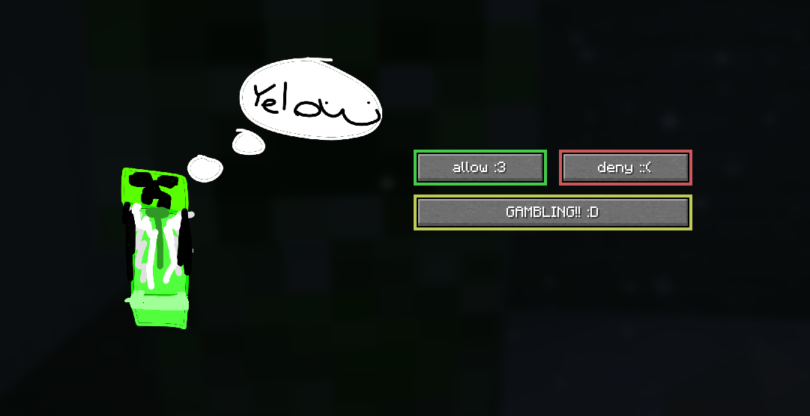
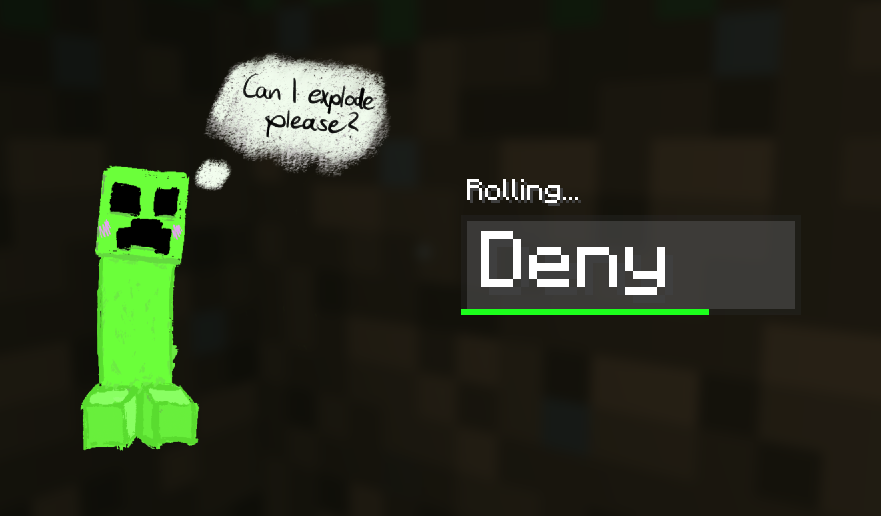
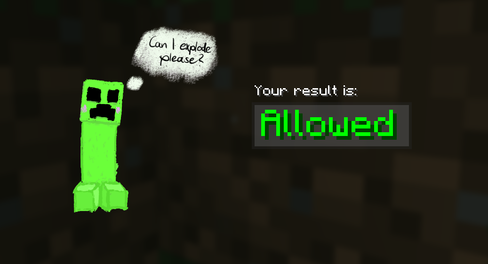
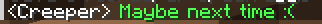
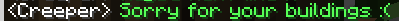

<!------------>
<!-- Start  -->
<!------------>

<h1 align="center">Better Creeper Consent</h1>

Allow or deny every creeper explosion that happens around you!

    

<!-- Badges  -->

    <!-- Curse  -->
    
    <!-- Modrinth  -->
    
    <!-- Fabric API  -->
    
    <!-- Ko-fi  -->
    

---

    Ever had creepers walk behind your back and destroy your buildings?  
    This mod gives you the power to simply click <strong>Deny</strong> when creepers want to explode!

<!----------->
<!-- Rest  -->
<!----------->

<h2 align="center">❗ Requirements ❗</h2>

> [!IMPORTANT]
> Better Creeper Consent won't launch without these mods installed

- Minecraft - `26.2` (as of now only 1 version is supported)
- [Fabric API](https://modrinth.com/mod/fabric-api) - *(a version that supports MC 26.2)*
- [Fabric Language Kotlin](https://modrinth.com/mod/fabric-language-kotlin) - *(a version that supports MC 26.2)*

<h2 align="center">Features</h2>

### Core Features

- Before a creeper explodes, a *screen pops up*, giving you 3 buttons to choose from.
- You can either `Allow` or `Deny` the request, or you can `Gamble` to let it be chosen randomly

> [!NOTE]
>
> - If there are multiple creepers around, only **1 gets to ask for consent**, while the other ones are _automatically denied and won't explode_.
> - While playing on multiplayer, note that **one creeper** sends a consent request to **one player** ONLY, and that's *the nearest player to the creeper*.

### Gambling ✨

If you wanna test your luck, you can press the `Gambling` button.
The gambling part is simple: if you roll `Allowed` - you explode, but if you roll `Denied` - you get a *random item*!

### Images

    
Images of Gambling

    <h3>Rolling</h3>
    Upon pressing the `Gambling` button, this screen pops up and immediately starts rolling:
    
     
    <h3>Result</h3>
    After 5 seconds, you'll get a result:
    

    
Bonus!

    When the creeper is denied:
     
    
     
    Or when you allow the explosion:
     
    

### Prizes
There are 3 categories of prizes you can get: Common, Rare and Legendary.
You can win various creeper-related items:

| Rarity       | Items                                         |
| ------------ | --------------------------------------------- |
| 🟩 Common    | Gunpowder, String, Dirt, Cobblestone, Oak Log |
| 🟦 Rare      | Raw Cod, TNT                                  |
| 🟨 Legendary | Creeper Head, Diamond, Golden Apple           |

> [!WARNING]
> There's also a 5% chance you get an **ignited TNT** in the place of the creeper, instead of getting an item drop.

<h2 align="center">Installation</h2>
1. Download the latest `.jar` file from here or from Modrinth
2. Locate your `mods/` folder
3. Put the BCC `.jar` file alongside with your Fabric API and Kotlin `.jar` files
4. Have fun!

<h2 align="center">Credits</h2>
- Thank you to my *lovely girlfriend* for making the illustrations, including the logo and the creepers :33
- [Creeper's Consent](https://github.com/GameMech007-git/Creeper-Consent) by GameMech007, giving the code foundation and the original idea for the mod

## License
MIT © wuritz